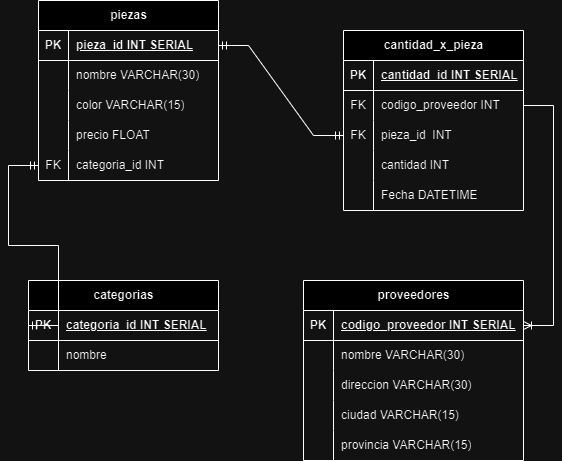

# Modelado de control de piezas

## Listado de entidades

### proveedores **(ED)**

- codigo_proveedor **PK**
- nombre
- direccion
- ciudad
- provincia

### piezas **(ED)**

- pieza_id **PK**
- nombre
- color
- precio
- categoria_id **FK**

### categorias **(EC)**

- categoria_id **PK**
- nombre

### cantidad_x_pieza **(EP)**

- cantidad_id **PK**
- codigo_provedor **FK**
- pieza_id **FK**
- cantidad
- fecha

## Relaciones

1. Una pieza tiene muchos **proveedores** (1 - M)
1. una pieza tiene una **categoria** (1 - 1)

## Entidad relación

